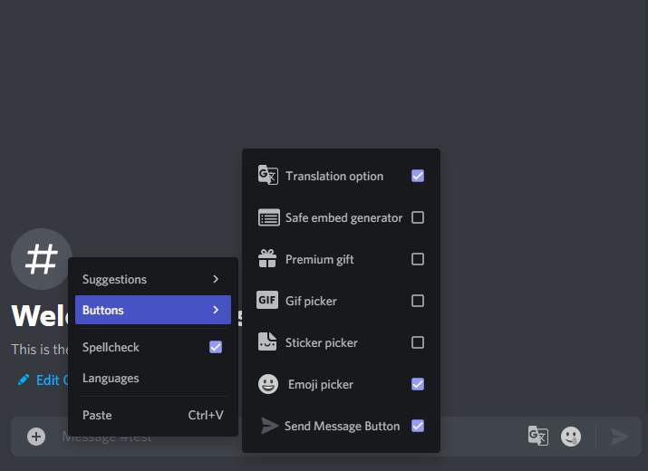

# Hide text area buttons

Adds a menu to hide buttons from the area input. The main feature is the ability to hide buttons added by other plugins.

### __For third party support__

It is recommended to use these [options](https://github.com/powerfart-plugins/translation-option/blob/2bdbb4ef83d800c3c53dba0517ad5487f2a3e73c/modules/Patcher.js#L130-L147) for injections where the button is a separate [component](https://github.com/powerfart-plugins/translation-option/blob/master/components/TranslationOptionButton.jsx)
